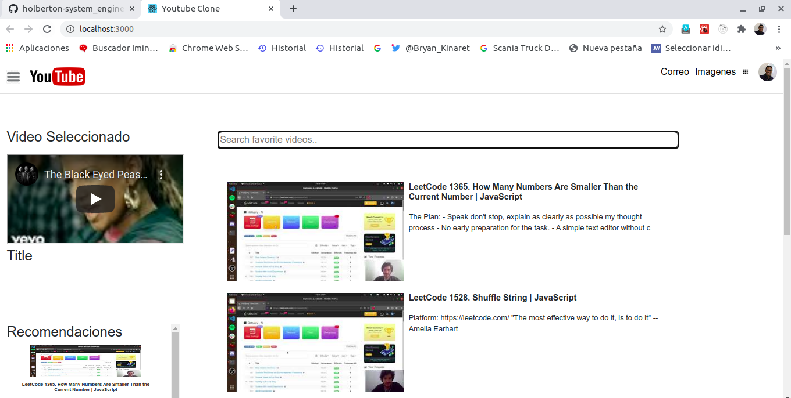
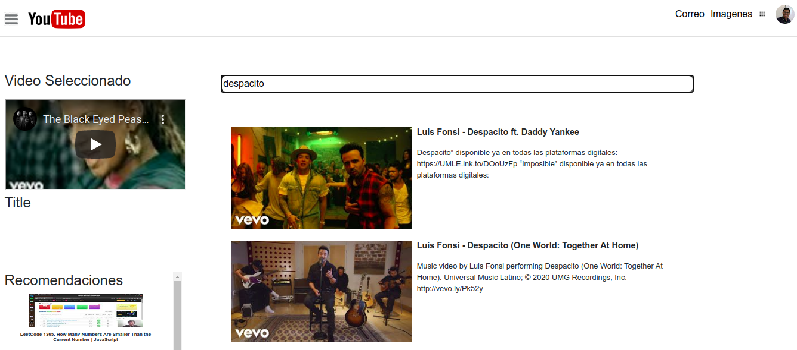

# CLONE YOUTUBE

## Description

Project created for interview, with the different functionalities to fulfill:


-   1. Bottom navigation tab bar: click on each tab to switch to a different page. (no need
to implement the detail EXCEPT for the Home page);
-   2. Home page: implement the Home list page with:

a. Scrollable list content, scroll up to load more items;
b. Like and Dislike button on each item;
-   3. Video detail page and mini bar: user should be able to navigate to the video detail
page when the user touches on each item in the home page list; when the user slides
the video view done to the bottom, a mini bar should be floating on the home page.





## Environment

Youtube Clone was built and tested in the Ubuntu 18.04 LTS  in React js trought Bootstrap and compiled Babel

## Instructions

```npm start```

-   Runs the app in the development mode.<br />
-   Open [http://localhost:3000](http://localhost:3000) to view it in the browser.


```npm install```

-   To bring all the congifurations and dependencies of the project to run in an excellent way

 
### How does it work
It is searched in the bar to watch and it is selected in turn it is played in the bar of the selected video

## Autor

-   ***Deiwin Ignacio Monsalve Altamar - <https://github.com/Deiwin-Ignacio-Monsalve-Altamar>***