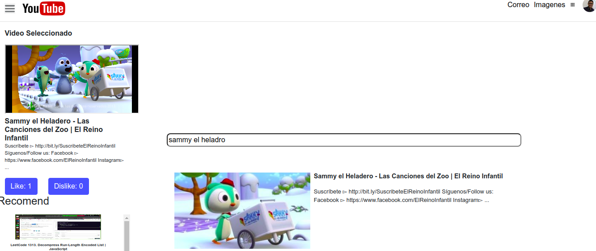
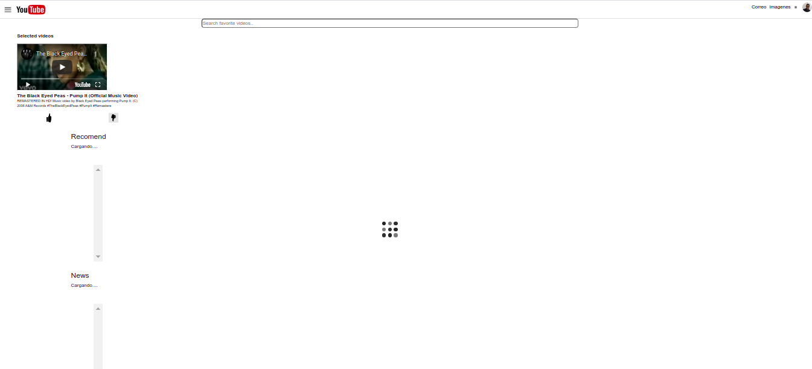
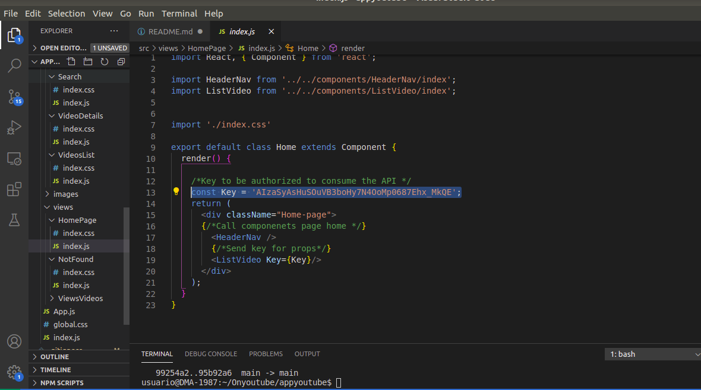

# CLONE YOUTUBE

## Description

Project created for interview, with the different functionalities to fulfill:


-   1. Bottom navigation tab bar: click on each tab to switch to a different page. (no need
to implement the detail EXCEPT for the Home page);
-   2. Home page: implement the Home list page with:

a. Scrollable list content, scroll up to load more items;
b. Like and Dislike button on each item;
-   3. Video detail page and mini bar: user should be able to navigate to the video detail
page when the user touches on each item in the home page list; when the user slides
the video view done to the bottom, a mini bar should be floating on the home page.





## Environment

Youtube Clone was built and tested in the Ubuntu 18.04 LTS  in React js trought Bootstrap and compiled Babel


## APIs

-   YouTube Data API v3 of Google APis

## Instructions

Requires Node.JS 10

- `npm install` to install the dependencies.
- `npm run dev` for the development environment.
- `npm run build` for the production environment.
 
### How does it work
It is searched in the bar to watch and it is selected in turn it is played in the bar of the selected video


# IMPORTANT!

#### Problem 
- If when you start requesting these the api gets a message and the page stays this way




- ***Normally this happens because a 403 error message was generated, that is, the created credential expired so the api cannot be consumed, it is important to remember that to interact with the youtube api they give it a time limit and thus again create it again***

#### Answer


- In the code enter the ```src/``` folder and in ```components/``` in the ```viwes/``` folder, change the key in the ```Home.js``` file and thus where the ```const Key``` variable is located, change the value



## Autor

-   ***Deiwin Ignacio Monsalve Altamar - <https://github.com/Deiwin-Ignacio-Monsalve-Altamar>***

